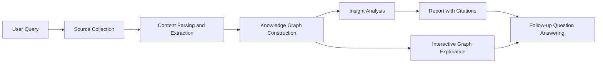

# ARA Graph Assistant

  Autonomous Research Assistant powered by a dynamic Knowledge Graph

  
  
  

---

## Overview

ARA Graph Assistant helps you run deep, source-backed research from a single prompt and turns findings into an explorable knowledge graph.

**Example prompt**

> "Research the impact of artificial intelligence on healthcare."

---

## Core Capabilities

| Capability                 | Description                                                                     |
| -------------------------- | ------------------------------------------------------------------------------- |
| Multi-source discovery     | Collects information from papers, articles, reports, and trusted websites       |
| Content understanding      | Extracts key concepts, facts, and relationships from retrieved material         |
| Knowledge graph generation | Builds nodes (concepts) and edges (relationships) to represent domain knowledge |
| Insight detection          | Highlights agreements, disagreements, and contradictions across sources         |
| Structured reporting       | Produces a comprehensive summary with citations                                 |
| Interactive exploration    | Lets users inspect concepts, connections, and source traceability               |
| Follow-up Q&A              | Answers additional questions using the already-built research context           |

---

## How It Works

---

## Typical Workflow

1. Submit a research question.
2. Review collected sources and extracted concepts.
3. Explore the generated knowledge graph.
4. Read the synthesized report with citations.
5. Ask follow-up questions for deeper analysis.

---

## Use Cases

- Academic and literature review support
- Early-stage domain exploration for projects
- Competitive and technology landscape mapping
- Topic briefing with transparent source grounding

---

## Project Vision

ARA Graph Assistant is designed to make research:

- Faster than manual source-by-source reading
- Transparent through explicit source linking
- Navigable through graph-based exploration

---

## Contributing

Contributions are welcome. If you plan to add features or improve the research pipeline, open an issue first to discuss scope and design.

---
